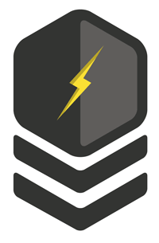

# {Skill Category} - Master Badge

(change to your badge image)

-----

## Goal
- You have already completed the Apprentice and Journeyman levels of this category.
- You have demonstrated that you can mentor & teach others how to {Skill Category}.
- You have demonstrated that you have an master-level understanding and skill in {Skill Category}
- You have sought out and obtained newly relevant & advanced knowledge of {Skill Category}
- You have completed project work that furthers our discipline in {Skill Category}

-----

## Project Plan(s)
*(This should have more free-form, mentorship-based requirements in Master level)*

**Create a project plan that outlines:**

  1) What you wish to build  
  2) Why it is important  
  3) How it will benefit our discipline  

- [ ] Have your project plan approved by a master in this skill
- [ ] Complete your project and present your learning to a gathering of web developers
- [ ] Live as legend and mentor for others in this category

## Current {Skill Category} Masters:
- {Person Name}

-----

*Is this badge missing something? Submit a PR and review it with a master in this category*
